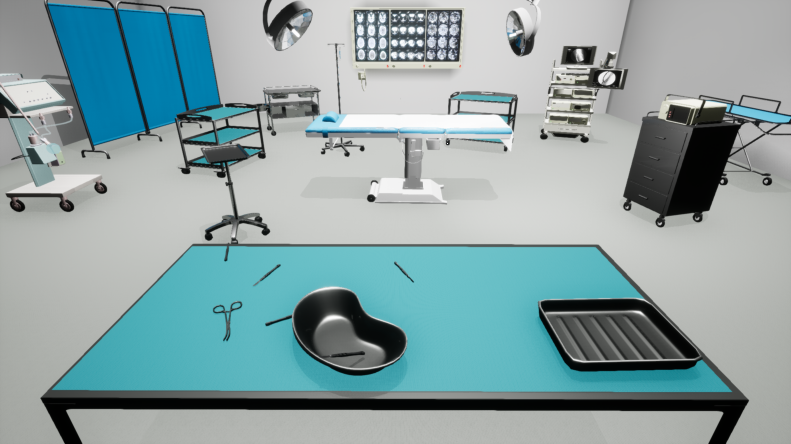
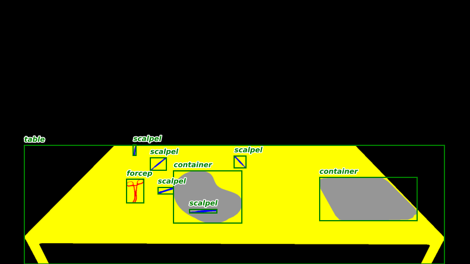

## Contact Information
Email: James.Ireland.phd@gmail.com

## Research interests  
* Computer Vision 
* Machine Learning 
* Artifical Inteligence  
* Robotics
* Human Robot Interaction (HRI) 
* Human Computer Interaction (HCI) 

## Datasets
### Synthetic Operating Room Table (SORT) Dataset

The Synthetic Operating Room Table (SORT) dataset is a largescale computer vision focused on instance counting, segmentation and localisation surgical instrument depictions placed on a table. 
Each class contains two different 3D representations equally likely to be present for a given instance, with exception of the container class that leverages three different 3D models. 
In total, we generated 89,838 images, split into 60% training (53,906), 20% validation (17,965), and 20% test (17,967), containing 365,469, 121,951 and 122,142 separate object instances, respectively. 



  The depictions contained are rendered using the <a href="https://www.unrealengine.com">Unreal</a> game engine and annotated leveraging the <a href="https://unrealcv.org">UnrealCV</a> plugin. 
  SORT contains one container class, one material class (gauze) and six instrument classes namely, forceps, scalpels, pincettes (tweezers), syringes, periotomes, and scissors. To aid in generalisability, each class contains two different 3D representations equally likely to be present for a given instance, with exception of the container class that leverages three different 3D models.
  
 &nbsp;
  * <a href="https://github.com/James-Ireland/Synthetic_OR_table_generative_game">Link to our game with custom UnrealCV plug-in </a>
  
 *  <a href="https://github.com/James-Ireland/Surgical_instrument_instance_counting_benchmarks">Link to benchmarking code</a>
  
  * <a href="https://doi.org/10.7910/DVN/UCG5CW">doi:10.7910/DVN/UCG5CW</a>
    
&nbsp;

### Multiple Sensors Multi-instance (MSMI) Dataset
Coming soon ....

## Publications
```bibtex

@inproceedings{RN12661,
   author = {Ireland, James and Radwan, Ibrahim and Herath, Damith and Goecke, Roland},
   title = {Can Synthetic Data Improve Multi-Class Counting of Surgical Instruments?},
   booktitle = {2022 International Conference on Digital Image Computing: Techniques and Applications (DICTA)},
   publisher = {IEEE},
   pages = {1-8},
   abstract = {Counting is a common preventative measure taken to ensure surgical instruments are not retained during surgery, which could cause serious detrimental effects including chronic pain and sepsis. 
   A hybrid human-AI system could support or partially automate this manual counting of instruments. 
   An important element to evaluate the viability of using deep learning computer vision-based counting is a suitable large-scale dataset of surgical instruments. 
   Other domains, such as crowd analysis and instance counting, have leveraged synthetic datasets to evaluate and augment different approaches. 
   We present a synthetic dataset (SORT), which is complemented by a smaller real-world dataset of surgical instruments (MSMI), to assess the hypothesis of whether synthetic training data can improve the performance of multi-class multi-instance counting models when applied to real-world data. 
   In this preliminary study, we provide comparative baselines for various popular counting techniques on synthetic data, such as direct regression, segmentation, localisation, and density estimation. 
   These experiments are repeated at different resolutions – full high-definition (1080×1920 pixels), half (690×540 pixels), and a quarter (480×270 pixels) – to measure the robustness of different supervision methods to varying image scales. 
   The results indicate that neither the degree of supervision nor the image resolution during model training impact performance significantly on the synthetic data. 
   However, when testing on the real-world instrument dataset, the models trained on synthetic data were significantly less accurate. 
   These results indicate a need for further work in either the refinement of the synthetic depictions or fine-tuning upon real-world data to achieve similar performance in domain adaptation scenarios compared to training and testing solely on the synthetic data.},
   DOI = {10.1109/DICTA56598.2022.10034591},
   url = {https://ieeexplore.ieee.org/document/10034591},
   type = {Conference Proceedings}
}

@inproceedings{RN12736,
   author = {Ahmad, Dua’a and Goecke, Roland and Ireland, James},
   title = {CNN Depression Severity Level Estimation from Upper Body vs. Face-Only Images},
   series = {Pattern Recognition. ICPR International Workshops and Challenges},
   publisher = {Springer International Publishing},
   pages = {744-758},
   abstract = {Upper body gestures have proven to provide more information about a person’s depressive state when added to facial expressions. 
   While several studies on automatic depression analysis have looked into this impact, little is known in regard to how a convolutional neural network (CNN) uses such information for predicting depression severity levels. 
   This study investigates the performance in various CNN models when looking at facial images alone versus including the upper body when estimating depression severity levels on a regressive scale. 
   To assess generalisability of CNN model performance, two vastly different datasets were used, one collected by the Black Dog Institute and the other being the 2013 Audio/Visual Emotion Challenge (AVEC). 
   Results show that the differences in model performance between face versus upper body are slight, as model performance across multiple architectures is very similar but varies when different datasets are introduced.},
   ISBN = {978-3-030-68780-9},
   type = {Conference Proceedings}
}

@inproceedings{RN12737,
   author = {Hinwood, David and Ireland, James and Jochum, Elizabeth Ann and Herath, Damith},
   title = {A Proposed Wizard of OZ Architecture for a Human-Robot Collaborative Drawing Task},
   series = {Social Robotics},
   publisher = {Springer International Publishing},
   pages = {35-44},
   abstract = {Researching human-robot interaction “in the wild” can sometimes require insight from different fields. 
   Experiments that involve collaborative tasks are valuable opportunities for studying HRI and developing new tools. 
   The following describes a framework for an “in the wild” experiment situated in a public museum that involved a Wizard of OZ (WOZ) controlled robot. 
   The UR10 is a non-humanoid collaborative robot arm and was programmed to engage in a collaborative drawing task. 
   The purpose of this study was to evaluate how movement by a non-humanoid robot could affect participant experience. 
   While the current framework is designed for this particular task, the control architecture could be built upon to provide a base for various collaborative studies.},
   ISBN = {978-3-030-05204-1},
   type = {Conference Proceedings}
}

``` 


