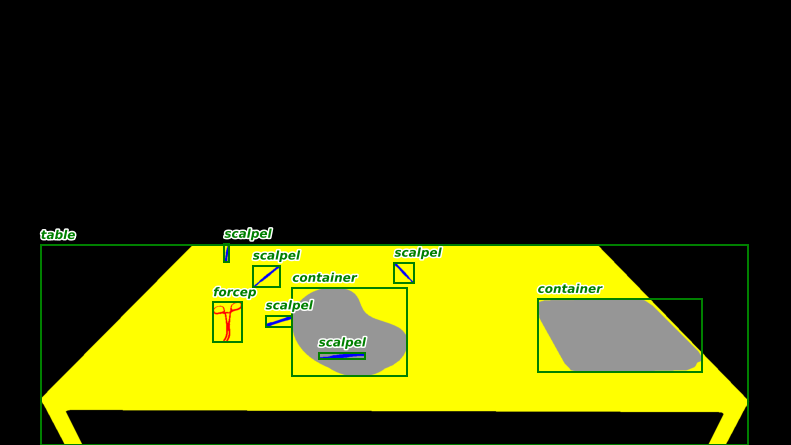

## Research interests  
* Computer Vision 
* Machine Learning 
* Artifical Inteligence  
* Robotics
* Human Robot Interaction (HRI) 
* Human Computer Interaction (HCI) 

## Datasets
### Synthetic Operating Room Table (SORT) Dataset

The Synthetic Operating Room Table (SORT) dataset is a largescale computer vision focused on instance counting, segmentation and localisation surgical instrument depictions placed on a table. Each class contains two different 3D representations equally likely to be present for a given instance, with exception of the container class that leverages three different 3D models. In total, we generated 89,838 images, split into 60% training (53,906), 20% validation (17,965), and 20% test (17,967), containing 365,469, 121,951 and 122,142 separate object instances, respectively. 

  The depictions contained are rendered using the <a href="https://www.unrealengine.com">Unreal</a> game engine and annotated leveraging the <a href="https://unrealcv.org">UnrealCV</a> plugin. 
  SORT contains one container class, one material class (gauze) and six instrument classes namely, forceps, scalpels, pincettes (tweezers), syringes, periotomes, and scissors. To aid in generalisability, each class contains two different 3D representations equally likely to be present for a given instance, with exception of the container class that leverages three different 3D models.
  
 &nbsp;
  * <a href="https://github.com/James-Ireland/Synthetic_OR_table_generative_game">Link to our game with custom UnrealCV plug-in </a>
  
 *  <a href="https://github.com/James-Ireland/Surgical_instrument_instance_counting_benchmarks">Link to benchmarking code</a>
  
  * <a href="https://doi.org/10.7910/DVN/UCG5CW">doi:10.7910/DVN/UCG5CW</a>
    
&nbsp;

### Multiple Sensors Multi-instance (MSMI) Dataset
Coming soon ....

## Publications

## Contact Information
Email: James.Ireland@canberra.edu.au
